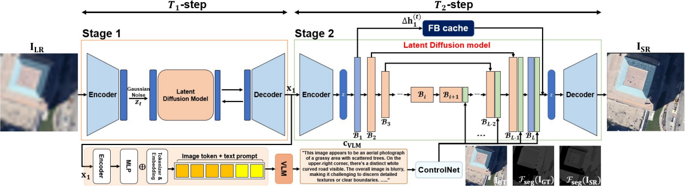
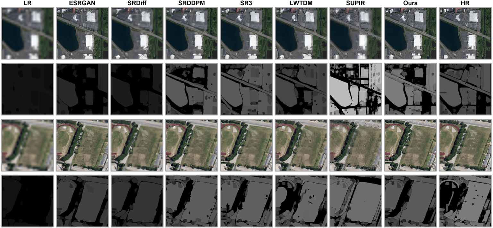
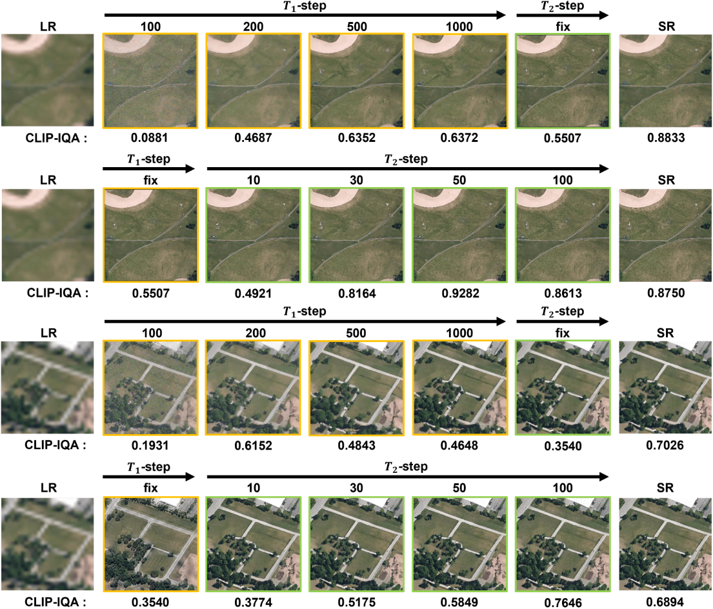

# A Novel VLM-Guided Diffusion Model for Remote Sensing Image Super-Resolution

## Abstract

[Early Access Paper (IEEE GRSL)](https://ieeexplore.ieee.org/document/11155158)

Abstract—Super-resolution (SR) of remote sensing imagery based on generative AI models is vital for practical applications
such as urban planning and disaster assessment. However, current approaches suffer from poor performance trade-offs
among the pivotal, yet competing, objectives: perceptual quality, factual accuracy, and inference speed. To break through this limitation, we propose a novel and high-performing two-stage SR framework for the remote sensing imagery based on a generative diffusion model. First, in Stage 1, factually grounded base images are generated by employing a guidance-free diffusion process relying solely on the original low-resolution images, such that the risk of semantic hallucination can be effectively mitigated.
The generated images are refined subsequently in Stage 2 such that high-frequency details for SR quality can be restored via
our customized and innovative guidance mechanism with a vision–language model (VLM) and a ControlNet, and a dynamic
inference acceleration technique is applied to ensure efficiency.
Extensive experimental results confirm that our proposed frame-work excels in perceptual quality—achieving top CLIP-IQA
scores—and in structural integrity while achieving robust per-formance. In particular, it enables reliable, high-fidelity SR for large-scale, real-world remote sensing pipelines by surpassing the conventional fidelity–hallucination trade-off at practical inference speed

## Architecture



## Results

### Visual Results: Ours vs Competing Methods



### Visual Results at Diffusion Steps



### Quantitative Comparison of Our SR Method with Existing Models

<table>
  <thead>
    <tr>
      <th rowspan="2">Model</th>
      <th colspan="3">SMS ↓</th>
      <th colspan="3">CLIP-IQA ↑</th>
    </tr>
    <tr>
      <th style="width:100px;">RSC11</th>
      <th style="width:100px;">RSSCN7</th>
      <th style="width:100px;">WHU-RS19</th>
      <th style="width:100px;">RSC11</th>
      <th style="width:100px;">RSSCN7</th>
      <th style="width:100px;">WHU-RS19</th>
    </tr>
  </thead>
  <tbody>
    <tr>
      <td>ESRGAN</td>
      <td>0.2788</td><td>0.2799</td><td>0.2822</td>
      <td>0.3439</td><td>0.3145</td><td>0.3486</td>
    </tr>
    <tr>
      <td>LWTDN</td>
      <td>0.2819</td><td>0.2749</td><td>0.2663</td>
      <td>0.5313</td><td>0.4745</td><td>0.5420</td>
    </tr>
    <tr>
      <td>SRDiff</td>
      <td>0.2997</td><td>0.3051</td><td>0.2987</td>
      <td>0.3270</td><td>0.2995</td><td>0.3738</td>
    </tr>
    <tr>
      <td>SRDDPM</td>
      <td>0.2438</td><td>0.2352</td><td>0.2325</td>
      <td>0.5551</td><td>0.4971</td><td>0.5618</td>
    </tr>
    <tr>
      <td>SR3</td>
      <td style="color: blue;"><b>0.2428</b></td><td style="color: red;"><b>0.2317</b></td><td style="color: red;"><b>0.2321</b></td>
      <td>0.6035</td><td>0.5472</td><td>0.6068</td>
    </tr>
    <tr>
      <td>SUPIR</td>
      <td>0.2920</td><td>0.2714</td><td>0.2973</td>
      <td style="color: blue;"><b>0.6360</b></td><td style="color: blue;"><b>0.6200</b></td><td style="color: blue;"><b>0.6078</b></td>
    </tr>
    <tr>
      <td><b>Ours</b></td>
      <td style="color: red;"><b><u>0.2291</u></b></td><td style="color: blue;"><b>0.2337</b></td><td style="color: blue;"><b>0.2400</b></td>
      <td style="color: red;"><b><u>0.7842</u></b></td><td style="color: red;"><b><u>0.7778</u></b></td><td style="color: red;"><b><u>0.7497</u></b></td>
    </tr>
  </tbody>
</table>

## Installation

```sh
conda create -n myenv python=3.10
conda activate myenv
# GPU stack ─ PyTorch 2.5.1 + CUDA 12.4
# Check your CUDA version, then install
conda install pytorch==2.5.1 torchvision==0.20.1 torchaudio==2.5.1 pytorch-cuda=12.4 -c pytorch -c nvidia
pip install -r requirements.txt
pip install flash-attn --no-build-isolation
```

## Download and Setup

```
Remote-Sensing-Vision-Language-Diffusion-Model/
├── CKPT_PTH/
│   ├── Llava-next/
│   ├── v0F.ckpt
│   ├── v0Q.ckpt
│   └── ...
├── README.md
├── infer.py
├── infer_dir.py
└── ...
```

[Download pretrained_model.zip (Google Drive)](https://drive.google.com/file/d/1OJ2wi75Ivdwtp8TjncQGpXjDqdwxVpL3/view?usp=sharing)

## Inference

### Single Image Inference

To run inference on a single image:

```sh
python infer.py --input_img path/to/your/image.png --output path/to/save/results --upscale 8
```

| Argument | Description |
|----------------|-------------|
|`--input_img` | path to a low-resolution input image (e.g., ./data/lr/image1.png) |
| `--output path` | directory where the super-resolved image will be saved (e.g., ./results) |
| `--upscale` | Upscaling factor (e.g., `2`, `4`, `8`) |

### Inference on Image Folder

```sh
python infer_dir.py --image_dir path/to/input/image_folder --save_dir path/to/save/results --upscale 8
```

| Argument | Description |
|----------------|-------------|
| `--image_dir` | directory containing low-resolution input images (e.g.,/data/lr) |
| `--save_dir` | directory where the super-resolved image will be saved (e.g., ./results) |
| `--upscale` | Upscaling factor (e.g., `2`, `4`, `8`) |
